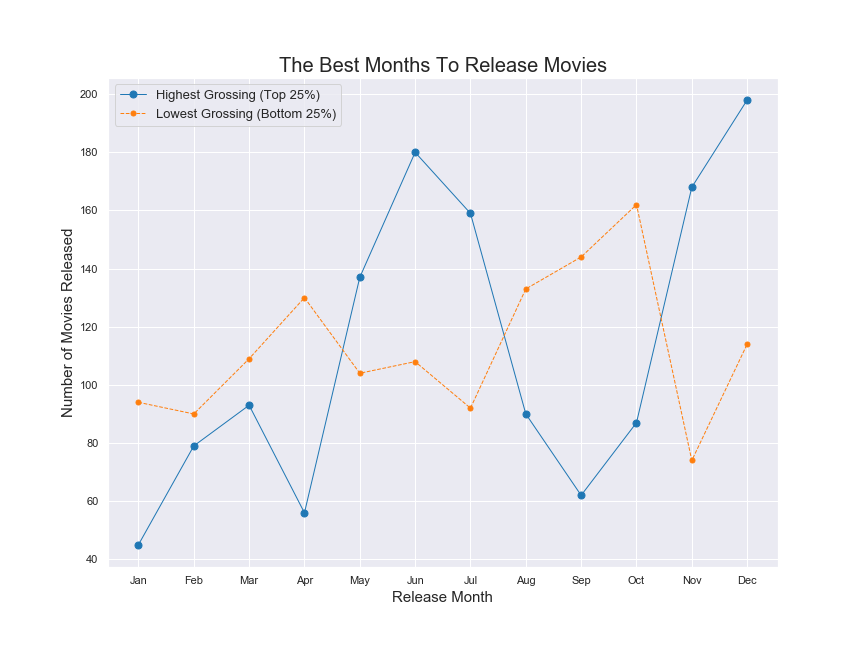
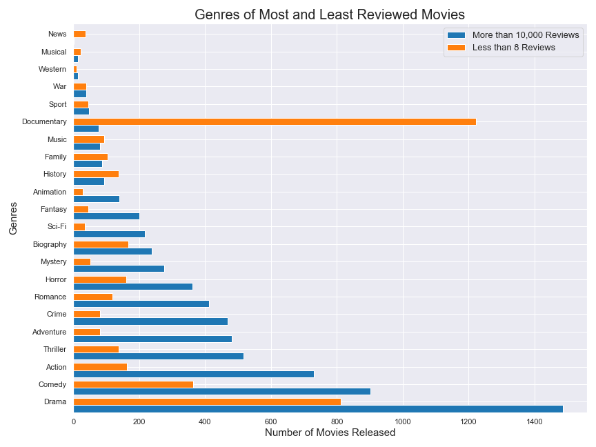
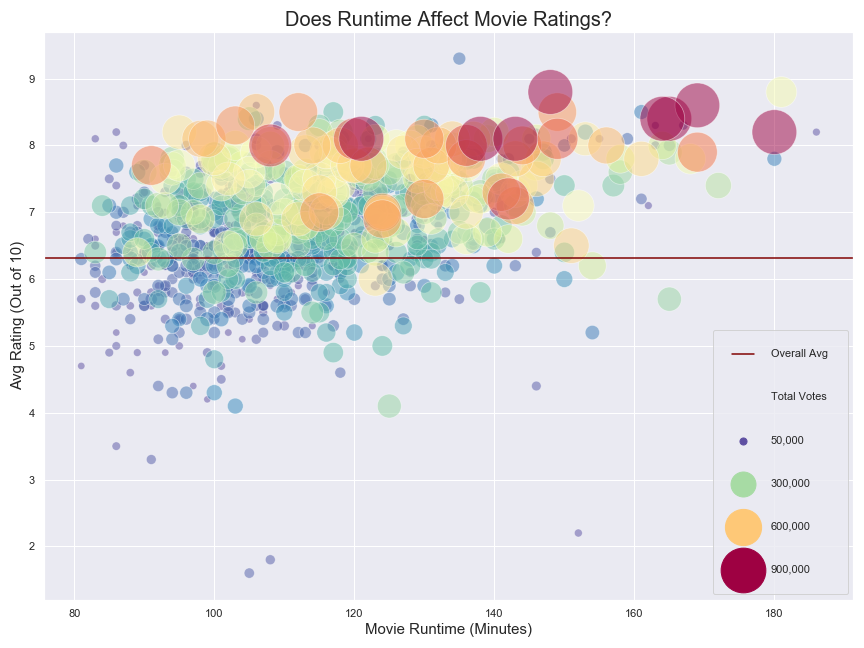

# Microsoft Movies: Entertainment Beyond Xbox

**Author**: [Shawn Samuel](mailto:shawnjohnsamuel@gmail.com)  

## Overview
This project analyzes the movie landscape to derive meaningful recommendations for Microsoft's potential new movie making entity. We used established movie information databases such as iMDB and The Numbers to obtain movie information . Descriptive analysis show's that certain release months and genres could contribute to overall popularity of movies. Microsoft can use this analysis to develop a measure of success for this venture and to guide creative decisions about movie production and timing.  

## Business Problem
Microsoft sees all the big companies creating original video content, and they want to get in on the fun. They have decided to create a new movie studio, but the problem is they don’t know anything about creating movies. They have hired us to help them better understand the movie industry. Our team is charged with exploring what type of films are currently doing the best at the box office. We must then translate those findings into actionable insights that the head of Microsoft's new movie studio can use to help decide what type of films to create.

## Data
[iMDB](https://help.imdb.com/article/imdb/general-information/what-is-imdb/G836CY29Z4SGNMK5?ref_=helpsect_cons_1_1#) is a leading aggregrator of movie information. We utilized the 'titles' (~100K entries) and 'ratings' (~70K entries) datasets to obtain information about release dates, genres, total votes, and average ratings. iMDB assigns unique id codes to each movie. [The Numbers](https://www.the-numbers.com/about) is another premier movie information site from which we obtained monetary information, like worldwide gross, for about 5K movies. We used multiple identifying elements such as title, runtime and genre to clean the dataset and deal with potential duplicates, empty values and outliers that could affect our analysis.

## Methods
This project uses descriptive analysis, including description of trends over time and comparisons of slices of the data sets considered popular vs not popular. We utilized various measures of success for each of our business questions. These can help guide Microsoft as it develops it's understanding of what success means for this new movie venture. Visualizations were our main output and source of analysis. 

## Results
The movies that were in the top 25% of worldwide gross tended to be released in the summer months of Jun/Jul or the winter months of Nov/Dec. These were also the months the bottom 25% of worldwide gross tended *not* to be released.


A large proportion of movies included the genre 'Drama'. 65% of these had 10,000 reviews or more. 'Comedy', 'Action', and 'Thriller' were the next three genre's with the highest number of movies with 10,000 reviews or more. These three genres also had higher ratios of movies with high voting engagment (10,000+ reviews) to movies with low voting engagement (8 reviews or less). You'll also notice a very high frequency of 'Documenteries' that have 8 reviews or less.



When focused on movies with high voter engagement (50,000+ votes), there are movies with above average ratings with a variety of runtimes. We do however see they are clustered in the 100-150 min range.



## Conclusions
This analysis leads to three recommendations for Microsoft's movie studio:
1. **What do people want to watch?** Focus on the Comedy, Action and Thriller genres when creating movies and avoid Documentaries. 
2. **When do people want to watch?** Plan production timetables to release movies in Jun/Jul or Nov/Dec.
3. **How long do people want to watch?** We recommend keeping movie lengths between 100 and 150 minutes.

## Next Steps
Further analysis could yield additional insights to further Microsoft's creative decision making:
- **Movie Franchises:** A quick glance at top grossing, most profitable, most reviewed and any other "top" lists of movies in the last 25 years, tend to include many movies that are part of a continuing franchise. We would recommend further research in this area. We would like to develop a business case that Microsoft should invest in creating movies in a new or exisiting franchisable library of content (eg. comics, book series, etc.)  
- **Video Game Based Movies:** A step beyond the point above, given Microsoft's 90 million active Xbox Live user base as an established and potential distribution channel for movies, it may be beneficial to research the video game based movie genre as a potential focus area. This would be especially profitable if it was connected to a video game or series that is already in the Xbox collection and offering.  
- **Quarantine Effect:** We know that COVID-19 restrictions have disrupted many industries, the entertainment industry included. Most of our data utilized the movie theatre release model so we would recommend concise research focused on the year 2020 to determine what the future of a disrupted industry may look like. This may in fact be the best time for Microsoft to attempt such a venture!

## For More Information

See the full analysis in the [Jupyter Notebook](project-notebook.ipynb) or review this [presentation](project-presentation.pdf).

For additional info, contact Shawn Samuel at [shawnjohnsamuel@gmail.com](mailto:shawnjohnsamuel@gmail.com)

## Repository Structure

```
├── [data](data)
├── [images](imdages)
├── [README.md](README.md)
├── [project-notebook.ipynb](project-notebook.ipynb)
└── [project-presendation.pdf](project-presentation.pdf)
```
